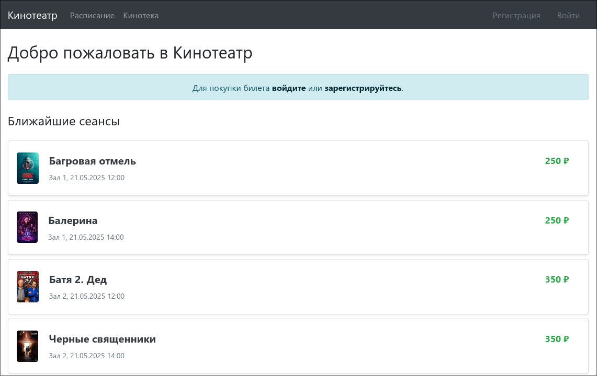
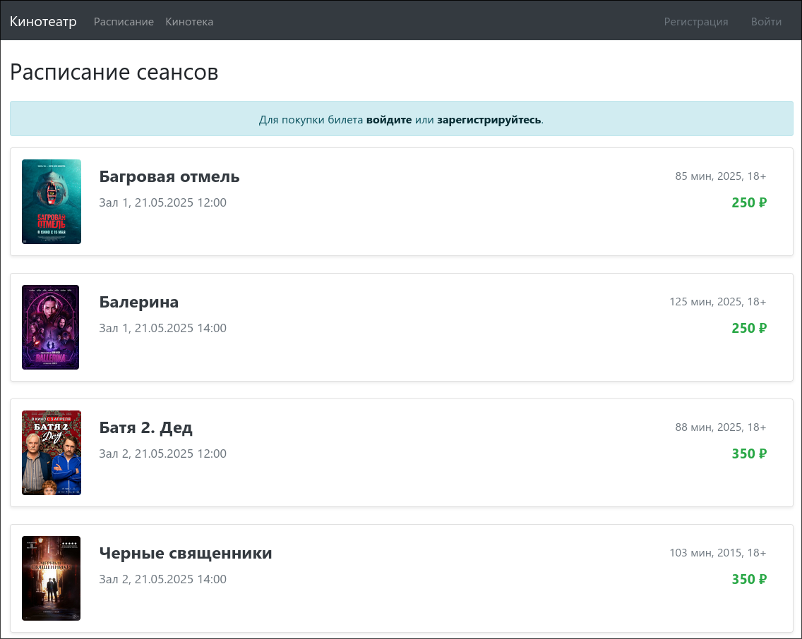
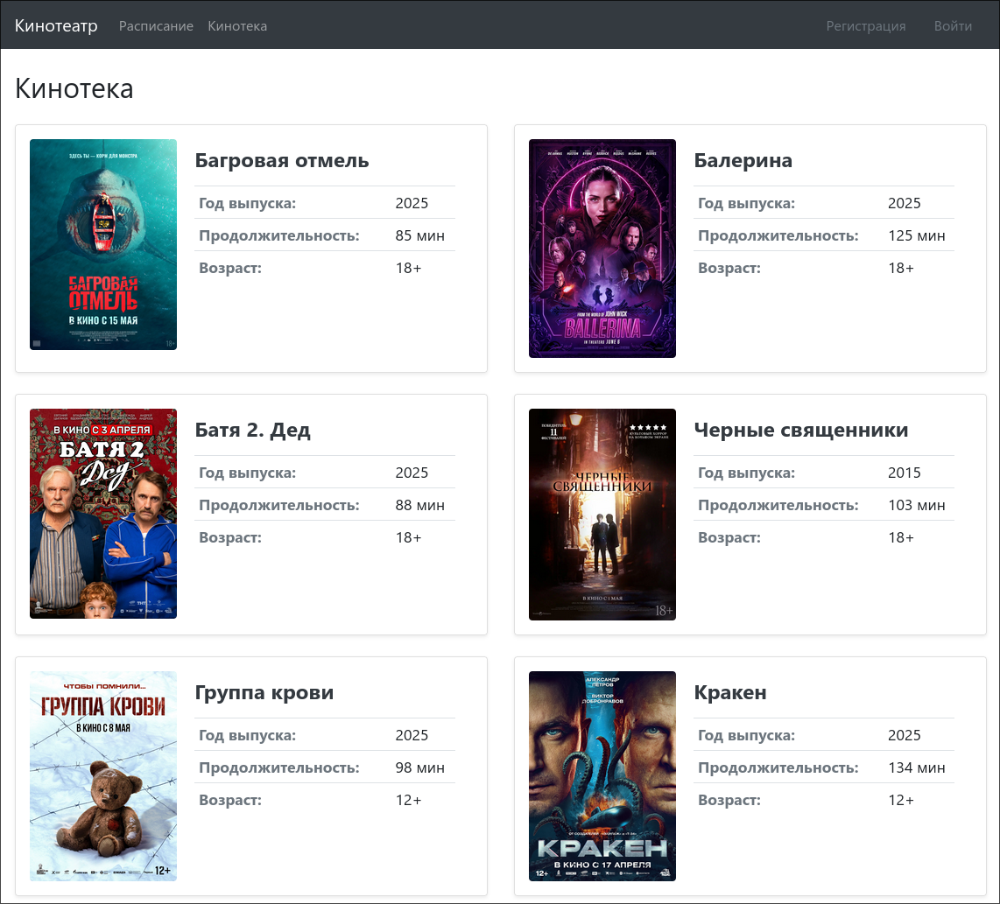
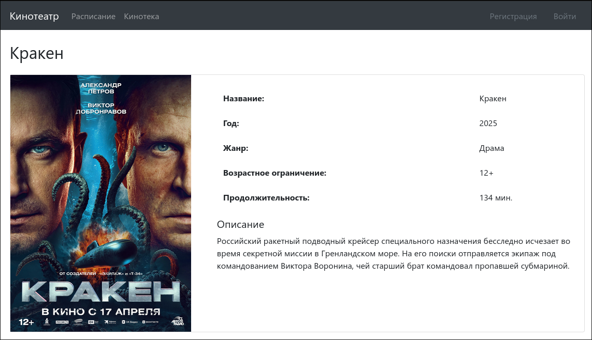
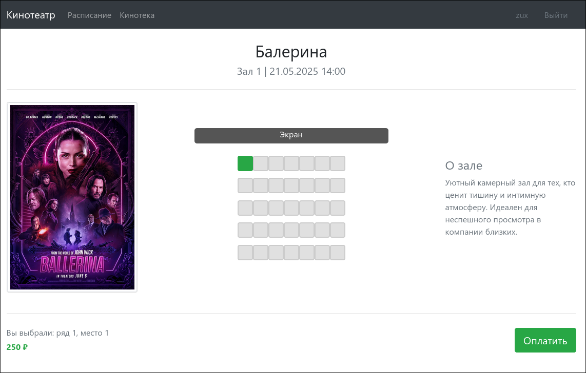
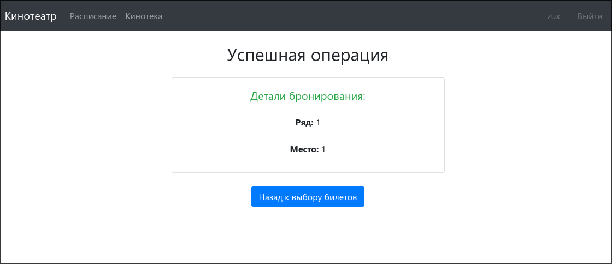
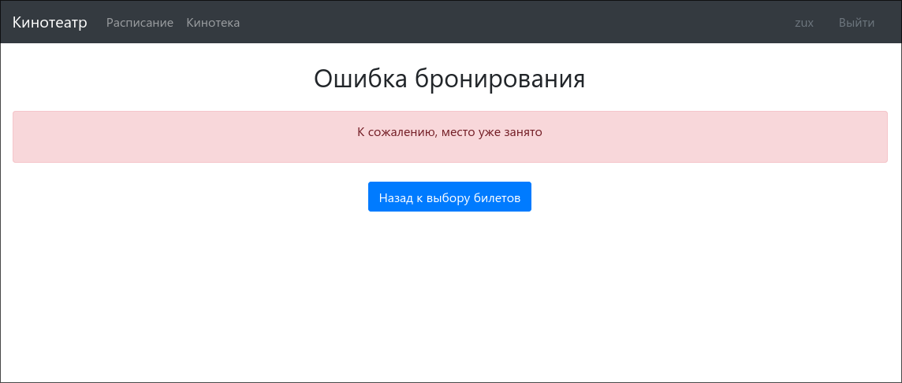
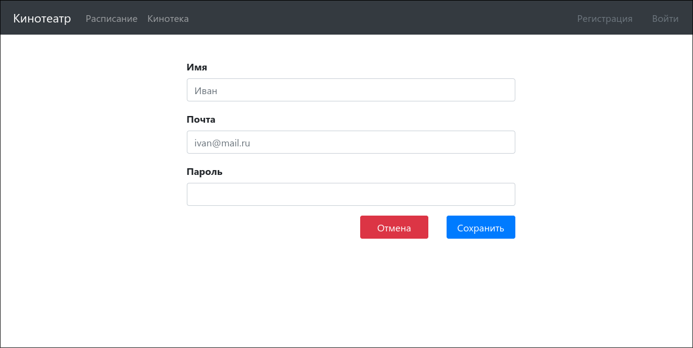
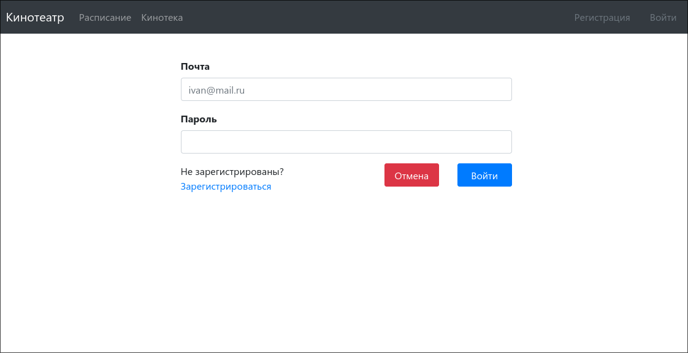

# job4j_cinema — Сервис Кинотеатр
## Описание проекта

Веб-приложение для одного кинотеатра, позволяющее пользователям:
- Зарегистрироваться и войти в аккаунт;
- Просматривать расписание киносеансов и каталог фильмов;
- Покупать билеты на доступные места;
- Получать информацию об успешной или неудачной покупке.

## Стек технологий

- **Java 21**
- **Spring Boot 3.4.5**
- **Thymeleaf 3.1.3**
- **Bootstrap 4.4.1**
- **MariaDB 11.7.2**
- **Sql2o 1.9.1**
- **Liquibase: 4.29.2**
- **Mockito 5.17.0**

## Требования к окружению

``` text
Java 21+, Maven 3.9, MariaDB 11
```

## Запуск проекта
1. Установить [mariaDB](https://mariadb.org/download/) и создать БД `cinema`;
2. Настроить параметры подключения в `application.properties`;
3. Запустить проект:
  ```bash
  mvn spring-boot:run
  ```
4. Открыть в браузере: http://localhost:8080


## Роли пользователей
- **Гость**: может просматривать расписание и фильмы.
- **Зарегистрированный пользователь**: может приобретать билеты.
> Переход на страницу покупки билета с неавторизованной сессией приводит к переадресации на страницу входа.

## Страницы

### **Главная — описание ресурса:**

### **Расписание — список сеансов с возможностью перейти к покупке:**

### **Кинотека — список фильмов:**

### **Фильм — карточка фильма:**

### **Покупка билета — выбор места, подтверждение:**

### **Успешная/неудачная покупка — сообщения об операции:**


### **Регистрация и вход:**

